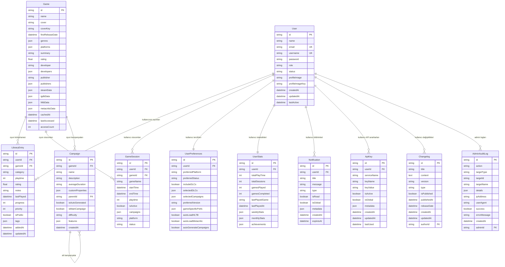

# 🗄️ Veritabanı Şeması

## 📋 Genel Bakış

Jun-Oro platformu, veritabanı yönetimi için **PostgreSQL** ve **Prisma ORM** kullanır. Veritabanı şeması, oyun kütüphanesi yönetimi, kullanıcı takibi ve oyun oturumları gibi temel işlevleri destekleyecek şekilde tasarlanmıştır.

### 🏗️ Veritabanı Mimarisi



## 📊 Temel Modeller

### 👤 User Modeli

Kullanıcı bilgilerini ve hesap durumunu saklar.

```prisma
model User {
  id              String            @id @default(cuid())
  name            String
  email           String?           @unique
  username        String?           @unique
  password        String?
  role            String            @default("user")
  status          String            @default("pending") // pending, active, suspended
  profileImage    String?           // URL to profile image in R2
  profileImageKey String?           // R2 object key for deletion
  createdAt       DateTime          @default(now())
  updatedAt       DateTime          @default(now()) @updatedAt
  lastActive      DateTime          @default(now())
  sessions        GameSession[]
  notifications   Notification[]
  pageVisits      PageVisit[]
  preferences     UserPreferences?
  userStats       UserStats?
  libraryEntries  LibraryEntry[]
  apiKeys         ApiKey[]
  changelogs      Changelog[]
  adminAuditLogs  AdminAuditLog[]

  @@map("users")
  @@index([email])
  @@index([username])
  @@index([status])
  @@index([lastActive])
  @@index([role])
}
```

**Alan Açıklamaları:**

- `id`: CUID formatında benzersiz kullanıcı kimliği
- `role`: Kullanıcı rolü ('user', 'admin', 'moderator')
- `status`: Hesap durumu ('pending', 'active', 'suspended')
- `profileImageKey`: Cloudflare R2'deki profil resmini silmek için kullanılan anahtar
- `lastActive`: Son giriş/activity zamanı

### 🎮 Game Modeli

Oyun bilgilerini ve external API verilerini saklar.

```prisma
model Game {
  id               String            @id
  name             String
  cover            String?
  coverKey         String?           // R2 object key for deletion
  firstReleaseDate DateTime?
  genres           Json?
  platforms        Json?
  summary          String?
  rating           Float?
  developer        String?
  developers       Json?
  publisher        String?
  publishers       Json?
  steamData        Json?
  igdbData         Json?
  hltbData         Json?
  metacriticData   Json?
  cachedAt         DateTime          @default(now())
  lastAccessed     DateTime          @default(now())
  accessCount      Int               @default(1)
  campaigns        Campaign[]
  sessions         GameSession[]
  libraryEntries   LibraryEntry[]

  @@map("games")
  @@index([name])
  @@index([firstReleaseDate])
  @@index([rating])
  @@index([lastAccessed])
  @@index([accessCount])
}
```

**Alan Açıklamaları:**

- `id`: External API'lerden gelen oyun ID'si
- `JSON` alanları: Esnek veri depolama için kullanılır (Steam, IGDB, HLTB verileri)
- `cachedAt`: Verinin ne zaman önbelleğe alındığını takip eder
- `accessCount`: Popüler oyunları belirlemek için kullanılır

### 📚 LibraryEntry Modeli

Kullanıcının oyun kütüphanesi girişlerini saklar.

```prisma
model LibraryEntry {
  id         String    @id @default(cuid())
  userId     String
  gameId     String
  category   String    @default("wishlist")
  playtime   Int       @default(0)
  rating     Float?
  notes      String?
  lastPlayed DateTime?
  progress   Int       @default(0)
  priority   Int       @default(3)
  isPublic   Boolean   @default(false)
  tags       Json?
  addedAt    DateTime  @default(now())
  updatedAt  DateTime  @default(now()) @updatedAt
  game       Game      @relation(fields: [gameId], references: [id])
  user       User      @relation(fields: [userId], references: [id], onDelete: Cascade)

  @@unique([userId, gameId])
  @@map("library_entries")
  @@index([userId])
  @@index([gameId])
  @@index([category])
  @@index([priority])
  @@index([lastPlayed])
  @@index([isPublic])
}
```

**Alan Açıklamaları:**

- `category`: 'wishlist', 'playing', 'completed', 'backlog' değerlerini alabilir
- `priority`: 1 (yüksek) - 5 (düşük) öncelik skalası
- `tags`: Etiketleme sistemi için JSON formatında veri
- `progress`: Oyun ilerlemesi (%0-100)

## 🔄 İlişkisel Modeller

### ⏱️ GameSession Modeli

Kullanıcı oyun oturumlarını takip eder.

```prisma
model GameSession {
  id        String    @id @default(cuid())
  userId    String
  gameId    String
  gameName  String
  startTime DateTime  @default(now())
  endTime   DateTime?
  playtime  Int       @default(0)
  isActive  Boolean   @default(true)
  campaigns Json?
  platform  String?
  status    String?
  game      Game      @relation(fields: [gameId], references: [id])
  user      User      @relation(fields: [userId], references: [id], onDelete: Cascade)

  @@map("game_sessions")
  @@index([userId])
  @@index([gameId])
  @@index([startTime])
  @@index([isActive])
  @@index([platform])
}
```

**Alan Açıklamaları:**

- `isActive`: Aktif oturumları takip etmek için
- `campaigns`: Oyun içindeki kampanya/hikaye ilerlemesi
- `playtime`: Saniye cinsinden oyun süresi

### 📖 Campaign Modeli

Oyun kampanyalarını ve hikaye ilerlemesini saklar.

```prisma
model Campaign {
  id               String     @id @default(cuid())
  gameId           String
  name             String
  description      String?
  averageDuration  String?
  customProperties Json?
  parentId         String?
  isAutoGenerated  Boolean    @default(false)
  isMainCampaign   Boolean    @default(false)
  difficulty       String?
  features         Json?
  createdAt        DateTime   @default(now())
  game             Game       @relation(fields: [gameId], references: [id], onDelete: Cascade)
  parent           Campaign?  @relation("CampaignHierarchy", fields: [parentId], references: [id])
  children         Campaign[] @relation("CampaignHierarchy")

  @@map("campaigns")
}
```

**Alan Açıklamaları:**

- `parentId`: Alt kampanyalar için hiyerarşik yapı
- `isMainCampaign`: Ana hikaye kampanyası belirlemek için
- `difficulty`: 'easy', 'normal', 'hard', 'nightmare' gibi zorluk seviyeleri

## 🔧 Destek Modelleri

### ⚙️ UserPreferences Modeli

Kullanıcı tercihlerini ve ayarlarını saklar.

```prisma
model UserPreferences {
  id                    String  @id @default(cuid())
  userId                String  @unique
  preferredPlatform     String?
  preferredStatus       String  @default("Oynamak İstiyorum")
  includeDLCs           Boolean @default(false)
  selectedDLCs          Json?
  selectedCampaigns     Json?
  preferredVersion      String?
  gameSpecificPrefs     Json?
  autoLoadHLTB          Boolean @default(true)
  autoLoadMetacritic    Boolean @default(true)
  autoGenerateCampaigns Boolean @default(true)
  user                  User    @relation(fields: [userId], references: [id], onDelete: Cascade)

  @@map("user_preferences")
}
```

### 📈 UserStats Modeli

Kullanıcı istatistiklerini ve başarımlarını saklar.

```prisma
model UserStats {
  id             String    @id @default(cuid())
  userId         String    @unique
  totalPlayTime  Int       @default(0)
  totalSessions  Int       @default(0)
  gamesPlayed    Int       @default(0)
  gamesCompleted Int       @default(0)
  lastPlayedGame String?
  lastPlayedAt   DateTime?
  weeklyStats    Json?
  monthlyStats   Json?
  achievements   Json?
  user           User      @relation(fields: [userId], references: [id], onDelete: Cascade)

  @@map("user_stats")
}
```

### 🔑 ApiKey Modeli

External API anahtarlarını güvenli bir şekilde saklar.

```prisma
model ApiKey {
  id          String    @id @default(cuid())
  userId      String?
  serviceName String    // 'steam', 'igdb', 'twitch', etc.
  keyName     String    // Display name for the key
  keyValue    String    // Encrypted API key value
  isActive    Boolean   @default(true)
  isGlobal    Boolean   @default(false) // Global keys for all users vs user-specific
  metadata    Json?     // Additional configuration like client_id, endpoints, etc.
  createdAt   DateTime  @default(now())
  updatedAt   DateTime  @updatedAt
  lastUsed    DateTime?
  user        User?     @relation(fields: [userId], references: [id], onDelete: Cascade)

  @@unique([serviceName, userId]) // One key per service per user
  @@map("api_keys")
}
```

## 📋 Diğer Modeller

### 🔔 Notification Modeli

Kullanıcı bildirimlerini yönetir.

```prisma
model Notification {
  id        String    @id @default(cuid())
  userId    String?
  title     String
  message   String
  type      String    @default("info")
  isRead    Boolean   @default(false)
  isGlobal  Boolean   @default(false)
  metadata  Json?
  createdAt DateTime  @default(now())
  expiresAt DateTime?
  user      User?     @relation(fields: [userId], references: [id], onDelete: Cascade)

  @@map("notifications")
}
```

### 📝 Changelog Modeli

Sistem değişikliklerini ve sürüm notlarını saklar.

```prisma
model Changelog {
  id          String    @id @default(cuid())
  title       String
  content     String    @db.Text // Markdown content
  version     String?   // Optional version number
  type        String    @default("update") // update, feature, bugfix, etc.
  isPublished Boolean   @default(true)
  publishedAt DateTime? @default(now())
  releaseDate DateTime? // Release date for changelog
  createdAt   DateTime  @default(now())
  updatedAt   DateTime  @updatedAt
  authorId    String
  author      User      @relation(fields: [authorId], references: [id], onDelete: Cascade)

  @@map("changelogs")
}
```

### 🔍 AdminAuditLog Modeli

Admin işlemlerini ve güvenlik loglarını saklar.

```prisma
model AdminAuditLog {
  id          String   @id @default(cuid())
  action      String   // CREATE, UPDATE, DELETE, LOGIN, LOGOUT, etc.
  targetType  String   // USER, GAME, SYSTEM, etc.
  targetId    String?  // ID of affected resource
  targetName  String?  // Name/title of affected resource
  details     Json?    // Additional details about action
  ipAddress   String?  // IP address of admin
  userAgent   String?  // Browser/client info
  success     Boolean  @default(true)
  errorMessage String? // If action failed
  createdAt   DateTime @default(now())
  adminId     String
  admin       User     @relation(fields: [adminId], references: [id], onDelete: Cascade)

  @@map("admin_audit_logs")
}
```

## 🔄 Migration Süreci

### Migration Oluşturma

```bash
# Yeni migration oluştur
npx prisma migrate dev --name add_new_feature

# Development ortamında uygula
npx prisma migrate dev

# Production ortamına dağıt
npx prisma migrate deploy
```

### Migration Örneği

```sql
-- Migration: 20240101000000_add_game_categories
CREATE TYPE game_category AS ENUM (
  'action',
  'adventure',
  'rpg',
  'strategy',
  'simulation',
  'sports',
  'racing',
  'puzzle',
  'platformer',
  'other'
);

ALTER TABLE games
ADD COLUMN category game_category DEFAULT 'other';

-- Index ekle
CREATE INDEX idx_games_category ON games(category);
```

### Migration Geri Alma

```bash
# Son migration'u geri al
npx prisma migrate reset

# Belirli bir migration'a geri dön
npx prisma migrate resolve --rolled-back 20240101000000_add_game_categories
```

## 📊 Veri Tipleri ve Kısıtlamalar

### Veri Tipleri

| Alan Adı  | Veri Tipi | Açıklama                         | Örnek                  |
| --------- | --------- | -------------------------------- | ---------------------- |
| id        | String    | CUID formatında benzersiz kimlik | `clx123abc456`         |
| name      | String    | String veri                      | "The Witcher 3"        |
| rating    | Float     | Ondalıklı sayı                   | 8.5                    |
| playtime  | Int       | Tam sayı (saniye)                | 3600                   |
| createdAt | DateTime  | Zaman damgası                    | `2024-01-01 12:00:00`  |
| isActive  | Boolean   | True/False                       | `true`                 |
| genres    | Json      | JSON veri                        | `["RPG", "Adventure"]` |

### Kısıtlamalar

#### Unique Kısıtlamaları

```sql
-- Her kullanıcının her oyun için sadece bir kütüphane girişi olabilir
UNIQUE(userId, gameId) ON library_entries

-- Email adresleri benzersiz olmalı
UNIQUE(email) ON users

-- Kullanıcı adları benzersiz olmalı
UNIQUE(username) ON users

-- Platform adları benzersiz olmalı
UNIQUE(name) ON platforms
```

#### Check Kısıtlamaları

```sql
-- Rating değerleri 0-10 arasında olmalı
CHECK (rating >= 0 AND rating <= 10) ON games

-- Progress değerleri 0-100 arasında olmalı
CHECK (progress >= 0 AND progress <= 100) ON library_entries

-- Priority değerleri 1-5 arasında olmalı
CHECK (priority >= 1 AND priority <= 5) ON library_entries

-- Playtime negatif olamaz
CHECK (playtime >= 0) ON game_sessions
```

## 📈 Performans Optimizasyonu

### Index'ler

Veritabanı performansını optimize etmek için aşağıdaki index'ler kullanılır:

#### User Tablosu Index'leri

```sql
CREATE INDEX idx_users_email ON users(email);
CREATE INDEX idx_users_username ON users(username);
CREATE INDEX idx_users_status ON users(status);
CREATE INDEX idx_users_last_active ON users(lastActive);
CREATE INDEX idx_users_role ON users(role);
```

#### Game Tablosu Index'leri

```sql
CREATE INDEX idx_games_name ON games(name);
CREATE INDEX idx_games_release_date ON games(firstReleaseDate);
CREATE INDEX idx_games_rating ON games(rating);
CREATE INDEX idx_games_last_accessed ON games(lastAccessed);
CREATE INDEX idx_games_access_count ON games(accessCount);
```

#### LibraryEntry Tablosu Index'leri

```sql
CREATE INDEX idx_library_user_id ON library_entries(userId);
CREATE INDEX idx_library_game_id ON library_entries(gameId);
CREATE INDEX idx_library_category ON library_entries(category);
CREATE INDEX idx_library_priority ON library_entries(priority);
CREATE INDEX idx_library_last_played ON library_entries(lastPlayed);
CREATE INDEX idx_library_is_public ON library_entries(isPublic);
```

### Sorgu Optimizasyonu

#### Kütüphane Sorgusu

```sql
-- Optimize edilmiş kütüphane sorgusu
SELECT
  le.id,
  le.category,
  le.playtime,
  le.rating,
  le.progress,
  le.lastPlayed,
  g.id as game_id,
  g.name as game_name,
  g.cover,
  g.rating as game_rating
FROM library_entries le
JOIN games g ON le.gameId = g.id
WHERE le.userId = $1
ORDER BY le.lastPlayed DESC NULLS LAST, le.priority ASC
LIMIT 50;
```

#### İstatistik Sorgusu

```sql
-- Kullanıcı istatistikleri için optimize edilmiş sorgu
SELECT
  COUNT(DISTINCT le.gameId) as total_games,
  SUM(le.playtime) as total_playtime,
  COUNT(gs.id) as total_sessions,
  COUNT(CASE WHEN le.category = 'completed' THEN 1 END) as completed_games
FROM library_entries le
LEFT JOIN game_sessions gs ON le.userId = gs.userId AND le.gameId = gs.gameId
WHERE le.userId = $1;
```

## 💾 Backup ve Restore Prosedürleri

### Backup Script

```javascript
// backend/scripts/backup-database.js
const { PrismaClient } = require("@prisma/client");
const fs = require("fs");
const path = require("path");

const prisma = new PrismaClient();

async function backupDatabase() {
  const timestamp = new Date().toISOString().replace(/[:.]/g, "-");
  const backupPath = path.join(__dirname, `../backups/backup-${timestamp}.sql`);

  try {
    // PostgreSQL backup komutu
    const { execSync } = require("child_process");
    const dbUrl = process.env.DATABASE_URL;

    execSync(`pg_dump "${dbUrl}" > "${backupPath}"`, {
      stdio: "inherit",
    });

    console.log(`Backup oluşturuldu: ${backupPath}`);

    // Cloudflare R2'e yükle
    await uploadToR2(backupPath);
  } catch (error) {
    console.error("Backup hatası:", error);
  } finally {
    await prisma.$disconnect();
  }
}

backupDatabase();
```

### Restore Script

```javascript
// backend/scripts/restore-database.js
const { PrismaClient } = require("@prisma/client");
const fs = require("fs");

const prisma = new PrismaClient();

async function restoreDatabase(backupFile) {
  try {
    // Veritabanını sıfırla
    await prisma.$executeRaw`DROP SCHEMA public CASCADE`;
    await prisma.$executeRaw`CREATE SCHEMA public`;

    // Backup'tan geri yükle
    const { execSync } = require("child_process");
    const dbUrl = process.env.DATABASE_URL;

    execSync(`psql "${dbUrl}" < "${backupFile}"`, {
      stdio: "inherit",
    });

    // Migration'ları yeniden uygula
    execSync("npx prisma migrate deploy", {
      stdio: "inherit",
    });

    console.log("Veritabanı başarıyla geri yüklendi");
  } catch (error) {
    console.error("Restore hatası:", error);
  } finally {
    await prisma.$disconnect();
  }
}

// Kullanım: node restore-database.js backup-2024-01-01.sql
restoreDatabase(process.argv[2]);
```

## 🔐 Veri Güvenliği

### Hassas Veri Şifreleme

API anahtarları ve hassas veriler veritabanında şifreli olarak saklanır:

```javascript
// API key'leri şifreleme
const crypto = require("crypto");

function encryptApiKey(key) {
  const algorithm = "aes-256-gcm";
  const secretKey = process.env.ENCRYPTION_KEY;
  const iv = crypto.randomBytes(16);

  const cipher = crypto.createCipher(algorithm, secretKey, iv);

  let encrypted = cipher.update(key, "utf8", "hex");
  encrypted += cipher.final("hex");

  return {
    encrypted,
    iv: iv.toString("hex"),
  };
}
```

### Veri Temizleme Politikası

```sql
-- 1 yıldan eski inactive kullanıcıları sil
DELETE FROM users
WHERE status = 'suspended'
AND lastActive < NOW() - INTERVAL '1 year';

-- 6 aydır erişilmeyen oyun verilerini temizle
DELETE FROM games
WHERE lastAccessed < NOW() - INTERVAL '6 months'
AND id NOT IN (SELECT gameId FROM library_entries);

-- 3 aydır aktif olmayan oturumları kapat
UPDATE game_sessions
SET isActive = false, endTime = NOW()
WHERE isActive = true
AND startTime < NOW() - INTERVAL '3 days';
```

## 🔮 Gelecek Geliştirmeler

### Planlanan Özellikler

- **Veri Arşivleme**: Eski verileri arşivleme sistemi
- **Replication**: Okuma işlemleri için read replica
- **Partitioning**: Büyük tablolar için horizontal partitioning
- **Full-text Search**: Oyun araması için gelişmiş arama

### Performans İyileştirmeleri

- **Connection Pooling**: PgBouncer entegrasyonu
- **Query Caching**: Redis ile sorgu önbellekleme
- **Materialized Views**: Raporlama için optimize edilmiş view'lar
- **Database Sharding**: Büyük ölçek için veri dağıtımı

---

## 🧭 Navigasyon

- [← Ana Sayfa](Home.md)
- [↑ Geliştirici Rehberi](Developer-Guide.md)
- [→ API Referansı](API-Reference.md)
- [Deployment Rehberi](Deployment.md)

## 🔗 İlgili Sayfalar

- [Getting Started](Getting-Started.md)
- [User Guide](User-Guide.md)
- [Library Management](Library-Management.md)
- [Session Tracking](Session-Tracking.md)

---

**Etiketler:** `database` `schema` `prisma` `postgresql` `orm` `backend` `data-model`
