# Modüler ve Context Odaklı Refactor Planı

Bu plan, refactor işlemini yürütecek olan yapay zekanın 200k'lık context penceresi limiti göz önünde bulundurularak hazırlanmıştır. Fazlar, birbiriyle mantıksal olarak ilişkili ve tek seferde işlenebilecek dosya gruplarından (modüller veya özellikler) oluşur.

---

### **FAZ 0: Global Otomatik Temizlik** ✅ **TAMAMLANDI**

**Odak:** Tüm projeyi etkileyen, otomatik araçlarla yapılabilecek temel temizlik. Bu faz context'e dosya yüklemez.
**Hedef:** Kod tabanında tutarlı bir format ve stil temeli oluşturmak.
**Adımlar:**

1.  ✅ `prettier --write .` komutunu çalıştır.
2.  ✅ `npm run lint -- --fix` komutunu çalıştır.
**Sonuç:** Tüm dosyalar formatlandı, ancak 171 adet lint hatası/uyarısı tespit edildi. Bu hataların çoğu kullanılmayan değişkenler ve boş if blokları gibi temizlik sorunlarıdır.

---

### **FAZ 1: Migration Script'leri** ✅ **TAMAMLANDI**

**Odak:** Veritabanı taşıma script'lerinin yapısal refactor'ı ve hata yönetiminin güçlendirilmesi.
**Hedef:** Script'leri daha güvenli, okunabilir ve yeniden kullanılabilir hale getirmek.

- **Dosyalar:**
  - `C:\Users\ardat\Desktop\code\Neuer Ordner\jun-oro\migration\00-run-migration.js`
  - `C:\Users\ardat\Desktop\code\Neuer Ordner\jun-oro\migration\01-backup-databases.js`
  - `C:\Users\ardat\Desktop\code\Neuer Ordner\jun-oro\migration\02-migrate-users.js`
  - `C:\Users\ardat\Desktop\code\Neuer Ordner\jun-oro\migration\03-migrate-games.js`
  - `C:\Users\ardat\Desktop\code\Neuer Ordner\jun-oro\migration\utils\migrationHelpers.js` (yeni oluşturuldu)

**Başarıyla Tamamlanan İşlemler:**
1. Migration script'leri analiz edildi ve mevcut yapı değerlendirildi
2. Ortak yardımcı fonksiyonlar oluşturuldu (migration/utils/migrationHelpers.js)
3. Tüm migration script'leri refactor edildi:
   - 00-run-migration.js
   - 01-backup-databases.js
   - 02-migrate-users.js
   - 03-migrate-games.js

**Yapılan İyileştirmeler:**
- JSDoc comment'leri eklendi
- Magic number'lar constant'lara dönüştürüldü
- Error handling mekanizmaları standartlaştırıldı
- Structured logging uygulandı
- Async/await kullanımı standartlaştırıldı
- Early return pattern kullanıldı
- Fonksiyon boyutları 50 satırın altına indirildi
- Kod tekrarı ortadan kaldırıldı (DRY principle)
- Jun-Oro coding standards'larına uygun hale getirildi

---

### **FAZ 2: Backend - Çekirdek Kütüphaneler (Core Libs)**

**Odak:** Backend'in temelini oluşturan kütüphanelerin refactor edilmesi.
**Hedef:** Veritabanı, şifreleme ve doğrulama mantığını standartlara uygun hale getirmek.

- **Dosyalar:**
  - `C:\Users\ardat\Desktop\code\Neuer Ordner\jun-oro\backend\src\lib\prisma.js`
  - `C:\Users\ardat\Desktop\code\Neuer Ordner\jun-oro\backend\src\lib\encryption.js`
  - `C:\Users\ardat\Desktop\code\Neuer Ordner\jun-oro\backend\src\lib\validation.js`
  - `C:\Users\ardat\Desktop\code\Neuer Ordner\jun-oro\backend\src\lib\cloudflareR2.js`

---

### **FAZ 3: Backend - Ana Giriş ve Middleware'ler**

**Odak:** Sunucu başlangıç dosyası ve temel middleware'lerin düzenlenmesi.
**Hedef:** `index.js`'i sadeleştirmek ve middleware'leri modüler hale getirmek.

- **Dosyalar:**
  - `C:\Users\ardat\Desktop\code\Neuer Ordner\jun-oro\backend\src\index.js`
  - `C:\Users\ardat\Desktop\code\Neuer Ordner\jun-oro\backend\src\middleware\jwtAuth.js`
  - `C:\Users\ardat\Desktop\code\Neuer Ordner\jun-oro\backend\src\middleware\adminAudit.js`
  - `C:\Users\ardat\Desktop\code\Neuer Ordner\jun-oro\backend\src\middleware\cacheMiddleware.js`
  - `C:\Users\ardat\Desktop\code\Neuer Ordner\jun-oro\backend\src\middleware\transactionMiddleware.js`

---

### **FAZ 4: Backend - Kullanıcı ve Yetkilendirme Rotaları**

**Odak:** Kullanıcı işlemleri, yetkilendirme ve API anahtarlarıyla ilgili rotaların refactor'ı.
**Hedef:** Güvenlikle ilgili endpoint'leri bir arada ele alarak tutarlılığı sağlamak.

- **Dosyalar:**
  - `C:\Users\ardat\Desktop\code\Neuer Ordner\jun-oro\backend\src\routes\users.js`
  - `C:\Users\ardat\Desktop\code\Neuer Ordner\jun-oro\backend\src\routes\apiKeys.js`
  - `C:\Users\ardat\Desktop\code\Neuer Ordner\jun-oro\backend\create-admin-user.js`

---

### **FAZ 5: Backend - Oyun ve Kütüphane Rotaları**

**Odak:** Oyun verileri, kütüphane ve IGDB ile ilgili rotaların düzenlenmesi.
**Hedef:** Ana veri modellerine ait endpoint'leri birlikte iyileştirmek.

- **Dosyalar:**
  - `C:\Users\ardat\Desktop\code\Neuer Ordner\jun-oro\backend\src\routes\games.js`
  - `C:\Users\ardat\Desktop\code\Neuer Ordner\jun-oro\backend\src\routes\library.js`
  - `C:\Users\ardat\Desktop\code\Neuer Ordner\jun-oro\backend\src\routes\igdb.js`
  - `C:\Users\ardat\Desktop\code\Neuer Ordner\jun-oro\backend\src\routes\upload.js`

---

### **FAZ 6: Backend - İkincil Rotalar (Stats, Notifications vb.)**

**Odak:** İstatistikler, bildirimler ve diğer ikincil rotaların refactor'ı.

- **Dosyalar:**
  - `C:\Users\ardat\Desktop\code\Neuer Ordner\jun-oro\backend\src\routes\stats.js`
  - `C:\Users\ardat\Desktop\code\Neuer Ordner\jun-oro\backend\src\routes\notifications.js`
  - `C:\Users\ardat\Desktop\code\Neuer Ordner\jun-oro\backend\src\routes\sessions.js`
  - `C:\Users\ardat\Desktop\code\Neuer Ordner\jun-oro\backend\src\routes\preferences.js`
  - `C:\Users\ardat\Desktop\code\Neuer Ordner\jun-oro\backend\src\routes\changelog.js`
  - `C:\Users\ardat\Desktop\code\Neuer Ordner\jun-oro\backend\src\routes\updates.js`

---

### **FAZ 7: Frontend - Ana Yapı ve Context'ler**

**Odak:** Uygulamanın ana giriş noktası, layout'u ve global state yönetiminin refactor'ı.
**Hedef:** `App.jsx`'i temizlemek ve Context'leri daha yönetilebilir kılmak.

- **Dosyalar:**
  - `C:\Users\ardat\Desktop\code\Neuer Ordner\jun-oro\src\App.jsx`
  - `C:\Users\ardat\Desktop\code\Neuer Ordner\jun-oro\src\contexts\AuthContext.jsx`
  - `C:\Users\ardat\Desktop\code\Neuer Ordner\jun-oro\src\contexts\ActiveSessionContext.jsx`
  - `C:\Users\ardat\Desktop\code\Neuer Ordner\jun-oro\src\components\Header.jsx`
  - `C:\Users\ardat\Desktop\code\Neuer Ordner\jun-oro\src\components\SiteFooter.jsx`

---

### **FAZ 8: Frontend - "Oyun Ekleme" Modalı**

**Odak:** Projenin en karmaşık component'lerinden biri olan "AddGameModal"ın bütünsel refactor'ı.
**Hedef:** Bu özelliği oluşturan tüm alt component'leri ve mantığı tek seferde ele almak.

- **Dosyalar:**
  - `C:\Users\ardat\Desktop\code\Neuer Ordner\jun-oro\src\components\AddGameModal.jsx`
  - `C:\Users\ardat\Desktop\code\Neuer Ordner\jun-oro\src\components\AddGameModal\GameSearch.jsx`
  - `C:\Users\ardat\Desktop\code\Neuer Ordner\jun-oro\src\components\AddGameModal\GameDetails.jsx`
  - `C:\Users\ardat\Desktop\code\Neuer Ordner\jun-oro\src\components\AddGameModal\GameForm.jsx`
  - `C:\Users\ardat\Desktop\code\Neuer Ordner\jun-oro\src\components\AddGameModal\DLCSelection.jsx`
  - `C:\Users\ardat\Desktop\code\Neuer Ordner\jun-oro\src\components\AddGameModal\CampaignManagement.jsx`
  - `C:\Users\ardat\Desktop\code\Neuer Ordner\jun-oro\src\components\AddGameModal\utils.js`

---

### **FAZ 9: Frontend - "Ayarlar" Sayfası**

**Odak:** Ayarlar sayfasını ve ilgili tüm alt component'lerini bir bütün olarak ele almak.
**Hedef:** Yönetim panelinin bu önemli parçasını standartlara uygun hale getirmek.

- **Dosyalar:**
  - `C:\Users\ardat\Desktop\code\Neuer Ordner\jun-oro\src\pages\SettingsPage.jsx`
  - `C:\Users\ardat\Desktop\code\Neuer Ordner\jun-oro\src\hooks\useSettingsData.js`
  - `C:\Users\ardat\Desktop\code\Neuer Ordner\jun-oro\src\components\Settings\ProfileSettings.jsx`
  - `C:\Users\ardat\Desktop\code\Neuer Ordner\jun-oro\src\components\Settings\AdminUsers.jsx`
  - `C:\Users\ardat\Desktop\code\Neuer Ordner\jun-oro\src\components\Settings\UserModal.jsx`
  - `C:\Users\ardat\Desktop\code\Neuer Ordner\jun-oro\src\components\Settings\AdminIntegrations.jsx`
  - `C:\Users\ardat\Desktop\code\Neuer Ordner\jun-oro\src\components\Settings\AdminNotifications.jsx`

---

### **FAZ 10: Frontend - "Tutorial" Özelliği**

**Odak:** Kullanıcı eğitim (tutorial) özelliğini oluşturan tüm UI ve mantık dosyaları.
**Hedef:** Bu interaktif özelliği modüler ve bakımı kolay bir yapıya kavuşturmak.

- **Dosyalar:**
  - `C:\Users\ardat\Desktop\code\Neuer Ordner\jun-oro\src\hooks\useTutorial.js`
  - `C:\Users\ardat\Desktop\code\Neuer Ordner\jun-oro\src\components\Tutorial\TutorialOverlay.jsx`
  - `C:\Users\ardat\Desktop\code\Neuer Ordner\jun-oro\src\components\Tutorial\TutorialAdmin.jsx`
  - `C:\Users\ardat\Desktop\code\Neuer Ordner\jun-oro\src\components\Tutorial\TutorialEditModal.jsx`
  - `C:\Users\ardat\Desktop\code\Neuer Ordner\jun-oro\src\components\Tutorial\TutorialImportModal.jsx`
  - `C:\Users\ardat\Desktop\code\Neuer Ordner\jun-oro\src\utils\tutorialImportParser.js`

---

### **FAZ 11: Frontend - API Servisleri (Veri Çekme)**

**Odak:** Backend ve harici API'lerle iletişimi sağlayan servis katmanının refactor'ı.
**Hedef:** API çağrılarını merkezileştirmek, hata yönetimini ve cache mekanizmasını standartlaştırmak.

- **Dosyalar:**
  - `C:\Users\ardat\Desktop\code\Neuer Ordner\jun-oro\src\services\api.js`
  - `C:\Users\ardat\Desktop\code\Neuer Ordner\jun-oro\src\services\games.js`
  - `C:\Users\ardat\Desktop\code\Neuer Ordner\jun-oro\src\services\igdbApi.js`
  - `C:\Users\ardat\Desktop\code\Neuer Ordner\jun-oro\src\services\steamApi.js`
  - `C:\Users\ardat\Desktop\code\Neuer Ordner\jun-oro\src\services\userLibrary.js`
  - `C:\Users\ardat\Desktop\code\Neuer Ordner\jun-oro\src\services\userPreferences.js`
  - `C:\Users\ardat\Desktop\code\Neuer Ordner\jun-oro\src\services\cacheService.js`
  - `C:\Users\ardat\Desktop\code\Neuer Ordner\jun-oro\src\services\gameCache.js`

---

### **FAZ 12: Frontend - "Arkade" Arayüzü**

**Odak:** "Arkade" olarak adlandırılan özel dashboard, kütüphane ve session sayfaları.
**Hedef:** Bu çekirdek kullanıcı arayüzünün tutarlılığını ve performansını artırmak.

- **Dosyalar:**
  - `C:\Users\ardat\Desktop\code\Neuer Ordner\jun-oro\src\pages\ArkadeDashboard.jsx`
  - `C:\Users\ardat\Desktop\code\Neuer Ordner\jun-oro\src\pages\ArkadeLibrary.jsx`
  - `C:\Users\ardat\Desktop\code\Neuer Ordner\jun-oro\src\pages\ArkadeActiveSession.jsx`
  - `C:\Users\ardat\Desktop\code\Neuer Ordner\jun-oro\src\components\ArkadeHeader.jsx`
  - `C:\Users\ardat\Desktop\code\Neuer Ordner\jun-oro\src\components\ArkadeSidebar.jsx`

---

### **FAZ 13: Frontend - Diğer Sayfalar (HomePage, Backlog vb.)**

**Odak:** Kalan ana sayfaların yapısal refactor'ı.

- **Dosyalar:**
  - `C:\Users\ardat\Desktop\code\Neuer Ordner\jun-oro\src\pages\HomePage.jsx`
  - `C:\Users\ardat\Desktop\code\Neuer Ordner\jun-oro\src\pages\BacklogPage.jsx`
  - `C:\Users\ardat\Desktop\code\Neuer Ordner\jun-oro\src\pages\WishlistPage.jsx`
  - `C:\Users\ardat\Desktop\code\Neuer Ordner\jun-oro\src\pages\StatsPage.jsx`
  - `C:\Users\ardat\Desktop\code\Neuer Ordner\jun-oro\src\pages\LoginPage.jsx`

---

### **FAZ 14: Test Altyapısı ve E2E Testleri**

**Odak:** Test setup dosyaları ve E2E test script'lerinin refactor'ı.
**Hedef:** Testleri daha okunabilir ve bakımı kolay hale getirmek.

- **Dosyalar:**
  - `C:\Users\ardat\Desktop\code\Neuer Ordner\jun-oro\tests\setup.js`
  - `C:\Users\ardat\Desktop\code\Neuer Ordner\jun-oro\tests\mocks\server.js`
  - `C:\Users\ardat\Desktop\code\Neuer Ordner\jun-oro\tests\e2e\auth.e2e.spec.js`
  - `C:\Users\ardat\Desktop\code\Neuer Ordner\jun-oro\tests\e2e\user-journey.e2e.spec.js`
  - `C:\Users\ardat\Desktop\code\Neuer Ordner\jun-oro\tests\e2e\helpers\test-helpers.js`

---

### **FAZ 15: Son Dokunuşlar ve Dokümantasyon**

**Odak:** Tüm refactor edilen dosyalara standartlara uygun yorumlar eklemek ve son kontrolleri yapmak.
**Hedef:** Projeyi belgelenmiş ve kararlı bir şekilde teslim etmek.

- **Adımlar:**
  1.  Önceki fazlarda değiştirilen tüm dosyalardaki `export` edilmiş fonksiyonlara ve component'lere `GEMINI.md` formatında yorum blokları ekle.
  2.  `docs/ERS-REGISTRY.md` dosyasını, eklenen yeni ERS kodları ile güncelle.
  3.  Tüm projede `npm run lint`, `tsc --noEmit`, `npm test` ve `npm run build` komutlarını son kez çalıştırarak hata olmadığını doğrula.

---

### **Faz 2.2: 'Oyun Ekleme' Modalı Refactoring Planı**

**Odak:** Projenin en karmaşık bileşenlerinden biri olan `AddGameModal`'ın bütünsel olarak yeniden yapılandırılması.
**Hedef:** "God Component" yapısını ortadan kaldırmak, state yönetimini merkezileştirmek, "prop drilling" sorununu çözmek ve bileşenleri "Single Responsibility Principle" ilkesine uygun hale getirmek.

#### 1. Mevcut Durum Analizi

- **God Component:** `AddGameModal.jsx` (466 satır), arama, detay gösterme, form yönetimi, DLC/versiyon seçimi ve kampanya yönetimi gibi çok sayıda farklı sorumluluğu tek başına üstlenmektedir.
- **Aşırı State Kullanımı:** Bileşen içerisinde ~25 adet `useState` hook'u bulunmaktadır. Bu durum, state'in takibini ve yönetimini zorlaştırmaktadır.
- **Prop Drilling:** State'ler ve bu state'leri güncelleyen fonksiyonlar, `GameForm` gibi alt bileşenlere 15'ten fazla prop geçilerek "prop drilling" yoluyla iletilmektedir. Bu, kodun okunabilirliğini düşürmekte ve bakımını zorlaştırmaktadır.
- **Sorumlulukların Karışması:** `AddGameModal.jsx` hem UI'ın genel yapısını (modal, başlık, butonlar) hem de tüm iş mantığını (API çağrıları, state güncellemeleri, veri işleme) içermektedir.

#### 2. Önerilen Yeni Mimari: Custom Hook ve Context

Bu karmaşıklığı çözmek için **Custom Hook (`useAddGameModal`)** ve **Context API (`AddGameModalContext`)** tabanlı bir mimari önerilmektedir.

1.  **`useAddGameModal` (Custom Hook):**
    *   Tüm state yönetimi `useReducer` kullanılarak bu hook içinde merkezileştirilecektir. Bu, state güncellemelerini daha öngörülebilir ve yönetilebilir hale getirecektir.
    *   Tüm iş mantığı (API'ye arama isteği gönderme, oyunu kütüphaneye ekleme, variant'ları yükleme vb.) bu hook içinde yer alan fonksiyonlar (actions) tarafından yönetilecektir.
    *   Hook, dışarıya `state` ve `dispatch` fonksiyonlarını veya doğrudan çağrılabilecek aksiyon fonksiyonlarını (`searchGame`, `addGameToLibrary` vb.) sağlayacaktır.

2.  **`AddGameModalProvider` (Context Provider):**
    *   `useAddGameModal` hook'undan gelen `state` ve `dispatch`/aksiyonları, `value` olarak alacaktır.
    *   Bu provider, `AddGameModal`'ın en üst seviyesini sararak, altındaki tüm bileşenlerin prop drilling olmadan doğrudan state'e ve aksiyonlara erişmesini sağlayacaktır.

#### 3. Bileşenlerin Yeniden Yapılandırılması (Single Responsibility)

Mevcut bileşenler parçalanacak ve sorumlulukları netleştirilecektir.

- **`AddGameModal` (Ana Bileşen):**
    - **Sorumluluk:** Sadece modal'ın çerçevesini (portal, overlay, ana container), başlığı ve kapatma butonunu render etmek.
    - **İçerik:** `AddGameModalProvider` ile sarmalanacak ve mevcut duruma (`state.step`) göre `SearchStep`, `DetailsStep` veya `CampaignStep` gibi adımları gösterecektir. İçinde neredeyse hiç state veya iş mantığı kalmayacaktır.

- **`SearchStep` (Yeni Bileşen):**
    - **Sorumluluk:** Oyun arama arayüzünü ve sonuçlarını göstermek.
    - **İçerik:** `GameSearch` bileşenini içerir. Context'ten `state.searchTerm`, `state.searchResults`, `state.isSearching` gibi verileri alır ve `dispatch({ type: 'SEARCH_TERM_CHANGED', payload: '...' })` gibi aksiyonları tetikler.

- **`DetailsStep` (Yeni Bileşen):**
    - **Sorumluluk:** Seçilen oyunun detaylarını, formunu ve DLC/versiyon seçeneklerini göstermek.
    - **İçerik:** `GameDetails`, `GameForm` ve `DLCSelection` bileşenlerini bir araya getirir. Tüm verileri ve fonksiyonları Context'ten alır.

- **`CampaignStep` (Yeni Bileşen):**
    - **Sorumluluk:** Kampanya yönetimi arayüzünü göstermek.
    - **İçerik:** `CampaignManagement` bileşenini içerir.

- **`GameSearch`, `GameDetails`, `GameForm`, `DLCSelection`, `CampaignManagement` (Refactor Edilecek Alt Bileşenler):**
    - **Sorumluluk:** Prop almak yerine, ihtiyaç duydukları tüm verileri ve aksiyonları doğrudan `useContext(AddGameModalContext)` üzerinden alacaklardır. Bu sayede tamamen "prop-free" hale gelecekler ve kendi başlarına daha test edilebilir olacaklardır. Örneğin, `GameForm` artık `platform`, `setPlatform`, `gameStatus`, `setGameStatus` gibi onlarca prop almak yerine, `const { state, dispatch } = useAddGameModalContext()` ile her şeye erişecektir.

#### 4. State Yönetimi: `useState` -> `useReducer`

Mevcut ~25 `useState` hook'u, tek bir `useReducer` ile yönetilen merkezi bir state objesine dönüştürülecektir.

**Örnek `initialState`:**
```javascript
const initialState = {
  step: 'search', // 'search', 'details', 'campaign'
  searchTerm: '',
  searchResults: [],
  isSearching: false,
  selectedGame: null,
  // ... form state'leri
  platform: '',
  gameStatus: 'backlog',
  totalPlaytime: '',
  // ... variant/dlc state'leri
  gameVariants: { dlcs: [], expansions: [], editions: [] },
  selectedDlcs: [],
  // ... campaign state'leri
  campaigns: [],
  // ... diğerleri
  error: null,
  isAddingGame: false,
  editMode: false,
  editGameId: null,
};
```

**Örnek `reducer` aksiyonları:**
- `SET_STEP`
- `UPDATE_SEARCH_TERM`
- `SEARCH_START`
- `SEARCH_SUCCESS`
- `SEARCH_FAILURE`
- `SELECT_GAME`
- `UPDATE_FORM_FIELD`
- `ADD_GAME_START`
- `ADD_GAME_SUCCESS`
- `RESET_MODAL`

#### 5. Yeni Veri Akışı (Mermaid Diagramı)

```mermaid
graph TD
    subgraph AddGameModal
        A[AddGameModalProvider] --> B{useAddGameModal Hook};
        B --> C[State <useReducer>];
        B --> D[Actions <dispatch>];

        A --> E[Modal UI];
        E --> F{state.step?};

        subgraph Steps
            F -- 'search' --> G[SearchStep];
            F -- 'details' --> H[DetailsStep];
            F -- 'campaign' --> I[CampaignStep];
        end

        subgraph Components
            G --> G1[GameSearch];
            H --> H1[GameDetails];
            H --> H2[GameForm];
            H --> H3[DLCSelection];
            I --> I1[CampaignManagement];
        end

        G1 -- reads/dispatches --> A;
        H1 -- reads --> A;
        H2 -- reads/dispatches --> A;
        H3 -- reads/dispatches --> A;
        I1 -- reads/dispatches --> A;
    end

    style B fill:#222,stroke:#3f3,stroke-width:2px
    style C fill:#333,stroke:#888
    style D fill:#333,stroke:#888
    style A fill:#111,stroke:#0ff,stroke-width:2px
```



#### 6. Adım Adım Uygulama Planı

1.  **Hook ve Context Oluşturma:**
    - `src/hooks/useAddGameModal.js` dosyasını oluştur. İçinde `initialState`, `reducer` ve `useAddGameModal` hook'unu tanımla.
    - `src/contexts/AddGameModalContext.js` dosyasını oluştur. `AddGameModalContext` ve `AddGameModalProvider`'ı burada tanımla. Provider, `useAddGameModal`'ı kullanacak.

2.  **Ana Bileşeni (AddGameModal) Sadeleştirme:**
    - `AddGameModal.jsx` içindeki tüm `useState` hook'larını ve iş mantığı fonksiyonlarını sil.
    - Bileşenin render kısmını `AddGameModalProvider` ile sarmala.
    - İçeriği, `state.step`'e göre `SearchStep`, `DetailsStep` ve `CampaignStep` bileşenlerini render edecek şekilde yeniden düzenle.

3.  **Adım (Step) Bileşenlerini Oluşturma:**
    - `src/components/AddGameModal/steps/` adında yeni bir klasör oluştur.
    - `SearchStep.jsx`, `DetailsStep.jsx` ve `CampaignStep.jsx` dosyalarını oluştur. Bu bileşenler, ilgili alt bileşenleri içerecek ve sadece layout'tan sorumlu olacak.

4.  **Alt Bileşenleri Refactor Etme (Tek Tek):**
    - **`GameSearch.jsx`:** Tüm prop'ları kaldır. `useContext(AddGameModalContext)` kullanarak `state` ve `dispatch`'i al. `onChange` gibi event handler'ları `dispatch` çağrılarına dönüştür.
    - **`GameForm.jsx`:** Aynı şekilde, ~15 prop'u kaldır ve context'i kullan.
    - **`GameDetails.jsx`:** Prop'ları kaldır ve context'ten `state.selectedGame`'i oku.
    - **`DLCSelection.jsx`:** Prop'ları kaldır ve context'i kullan.
    - **`CampaignManagement.jsx`:** Prop'ları kaldır ve context'i kullan.

5.  **Temizlik ve Doğrulama:**
    - Tüm `prop-types` veya JSDoc comment'lerini yeni yapıya göre güncelle.
    - Kullanılmayan import'ları ve kod bloklarını temizle.
    - Modal'ın tüm işlevlerinin (arama, oyun seçme, form doldurma, kampanya ekleme, oyunu kaydetme) eskisi gibi çalıştığını manuel olarak test et.
