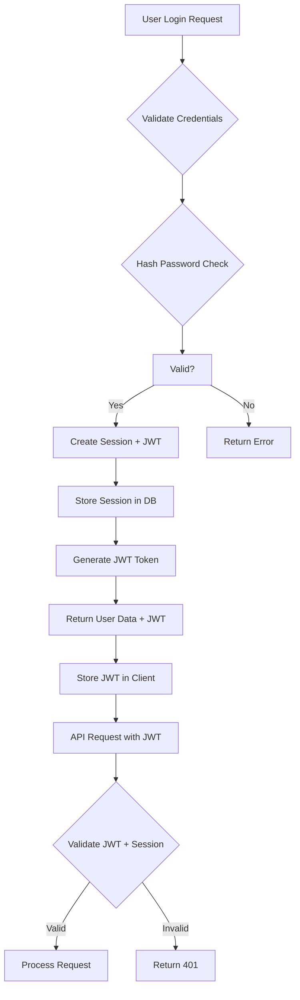

# Unified Authentication System Design

# Backend Prisma + Cloudflare API JWT Hybrid

## 🎯 AMAÇ

İki ayrık authentication sistemini (Backend Session-based + Cloudflare JWT-based) tek bir unified sisteme dönüştürmek.

## 📋 MEVCUT SİSTEMLER

### Backend Authentication (Prisma)

- **Type**: Session-based authentication
- **Storage**: PostgreSQL sessions tablosu
- **Flow**: Login → Session create → Session validation
- **Features**: Password hashing, session management, user activity tracking

### Cloudflare API Authentication (JWT)

- **Type**: JWT-based authentication
- **Storage**: PostgreSQL sessions tablosu + JWT token
- **Flow**: Login → JWT create → JWT validation
- **Features**: Password hashing, session management, token expiration

## 🔄 UNIFIED SİSTEM TASARIMI

### Hybrid JWT + Session Approach



### Authentication Flow

1. **User Login**
   - Username/password validation
   - Password hash verification
   - Account status check (active/suspended/pending)

2. **Session Creation**
   - Generate unique session ID
   - Store session in PostgreSQL with expiration
   - Set user activity (lastActive, lastLogin)

3. **JWT Token Generation**
   - Create JWT with user ID + session ID
   - Set expiration (24 hours default)
   - Sign with server secret

4. **Token Validation**
   - Verify JWT signature
   - Check session existence in database
   - Validate session expiration
   - Check user account status

## 🔧 TECHNİK IMPLEMENTASYON

### JWT Configuration

```javascript
const JWT_CONFIG = {
  secret: process.env.JWT_SECRET,
  expiresIn: "24h",
  algorithm: "HS256",
  issuer: "jun-oro-api",
  audience: "jun-oro-client",
};
```

### Session Management

```javascript
class SessionManager {
  async createSession(userId, userAgent, ipAddress) {
    const sessionId = generateCuid();
    const expiresAt = new Date(Date.now() + 24 * 60 * 60 * 1000);

    await prisma.session.create({
      data: {
        id: sessionId,
        userId,
        expiresAt,
        userAgent,
        ipAddress,
        isActive: true,
      },
    });

    return sessionId;
  }

  async validateSession(sessionId) {
    const session = await prisma.session.findFirst({
      where: {
        id: sessionId,
        isActive: true,
        expiresAt: { gt: new Date() },
      },
      include: {
        user: {
          select: {
            id: true,
            username: true,
            email: true,
            role: true,
            status: true,
            isActive: true,
          },
        },
      },
    });

    return session;
  }

  async invalidateSession(sessionId) {
    await prisma.session.update({
      where: { id: sessionId },
      data: { isActive: false },
    });
  }

  async invalidateUserSessions(userId) {
    await prisma.session.updateMany({
      where: { userId, isActive: true },
      data: { isActive: false },
    });
  }
}
```

### Authentication Middleware

```javascript
export async function unifiedAuthMiddleware(request, env) {
  try {
    // Extract JWT token
    const token = extractJWTFromRequest(request);

    if (!token) {
      return { success: false, message: "Authorization token required" };
    }

    // Verify JWT
    const payload = await verifyJWT(token, env.JWT_SECRET);
    if (!payload) {
      return { success: false, message: "Invalid or expired token" };
    }

    // Validate session in database
    const session = await validateSession(payload.sessionId);
    if (!session) {
      return { success: false, message: "Invalid or expired session" };
    }

    if (!session.user.isActive) {
      return { success: false, message: "User account is inactive" };
    }

    // Add user info to request
    request.user = {
      id: session.user.id,
      username: session.user.username,
      email: session.user.email,
      role: session.user.role,
      status: session.user.status,
      sessionId: session.id,
    };

    return { success: true, user: request.user };
  } catch (error) {
    console.error("Auth middleware error:", error);
    return { success: false, message: "Authentication failed" };
  }
}
```

## 🔐 SECURITY ÖNLEMLERİ

### Password Security

- **Hashing**: bcrypt with salt rounds = 12
- **Validation**: Minimum 8 characters, complexity requirements
- **Storage**: Never store plain text passwords

### JWT Security

- **Secret**: Environment variable, minimum 32 characters
- **Expiration**: Maximum 24 hours
- **Algorithm**: HS256 for server-to-server
- **Rotation**: Secret key rotation support

### Session Security

- **ID Generation**: Cryptographically secure (cuid)
- **Expiration**: 24 hours maximum
- **Cleanup**: Automatic cleanup of expired sessions
- **Rate Limiting**: Login attempt limiting

## 📱 CLIENT INTEGRASYONU

### Frontend Implementation

```javascript
class UnifiedAuthClient {
  constructor(apiUrl) {
    this.apiUrl = apiUrl;
    this.token = null;
    this.user = null;
  }

  async login(credentials) {
    const response = await fetch(`${this.apiUrl}/auth/login`, {
      method: "POST",
      headers: { "Content-Type": "application/json" },
      body: JSON.stringify(credentials),
    });

    const data = await response.json();

    if (data.success) {
      this.token = data.token;
      this.user = data.user;
      localStorage.setItem("auth_token", data.token);
      localStorage.setItem("user_data", JSON.stringify(data.user));
    }

    return data;
  }

  async logout() {
    const response = await fetch(`${this.apiUrl}/auth/logout`, {
      method: "POST",
      headers: {
        Authorization: `Bearer ${this.token}`,
        "Content-Type": "application/json",
      },
    });

    this.token = null;
    this.user = null;
    localStorage.removeItem("auth_token");
    localStorage.removeItem("user_data");

    return response.json();
  }

  getAuthHeaders() {
    return this.token
      ? {
          Authorization: `Bearer ${this.token}`,
          "Content-Type": "application/json",
        }
      : {
          "Content-Type": "application/json",
        };
  }

  isAuthenticated() {
    return !!this.token && !!this.user;
  }

  hasRole(role) {
    return this.user && this.user.role === role;
  }

  isAdmin() {
    return this.hasRole("admin");
  }
}
```

## 🔄 MIGRASYON STRATEJİSİ

### Phase 1: Backend Integration

1. Backend authentication routes'ını güncelle
2. JWT token generation ekle
3. Session management'i koru
4. Frontend integration'i test et

### Phase 2: Cloudflare API Integration

1. Cloudflare API authentication'ını güncelle
2. JWT validation ekle
3. Session management'i entegre et
4. API response format'ını standardize et

### Phase 3: Frontend Unification

1. Unified auth client oluştur
2. Mevcut auth logic'lerini değiştir
3. Token management'i birleştir
4. Error handling'i standardize et

## 📊 PERFORMANS METRİKLERİ

### Authentication Success Metrics

- Login success rate
- Token validation success rate
- Session creation success rate
- User activity tracking

### Security Metrics

- Failed login attempts
- Token validation failures
- Session expiration rate
- Account lockout events

### Performance Metrics

- Average authentication response time
- Database query performance
- JWT generation/verification time

## 🚨 RISK ANALİZİ

### High Risk Areas

1. **JWT Secret Exposure**
   - Environment variable security
   - Secret rotation requirements
2. **Session Hijacking**
   - Session ID randomness
   - Session expiration handling
   - IP validation

3. **Password Attacks**
   - Brute force protection
   - Password complexity requirements
   - Rate limiting

4. **Token Replay**
   - JWT expiration enforcement
   - Token invalidation on logout
   - Secure token storage

## 📋 IMPLEMENTASYON CHECKLIST

### Backend (Prisma)

- [ ] JWT token generation implement edildi
- [ ] Session management güncellendi
- [ ] Authentication middleware unified edildi
- [ ] Password security güçlendirildi
- [ ] Rate limiting eklendi
- [ ] Error handling standardize edildi

### Cloudflare API

- [ ] JWT validation implement edildi
- [ ] Session check eklendi
- [ ] Prisma client entegre edildi
- [ ] Response format unified edildi
- [ ] Error handling güncellendi

### Frontend

- [ ] Unified auth client oluşturuldu
- [ ] Token storage implement edildi
- [ ] Auto-refresh mekanizması eklendi
- [ ] Error handling birleştirildi
- [ ] Role-based access control eklendi

## 🔗 İLGİLİ DOSYALAR

- `backend/src/routes/users.js` - Mevcut authentication
- `cloudflare-api2/src/routes/auth.js` - Cloudflare authentication
- `cloudflare-api2/src/middleware/auth.js` - Middleware
- `src/contexts/AuthContext.jsx` - Frontend context
- `src/services/auth.js` - Frontend service
- `migration/` - Migration script'leri

---

**BU SİSTEM Jun-Oro projesindeki authentication fragmentation sorununu çözmek için tasarlanmıştır.**
**Implementasyon sonrası hem backend hem cloudflare API aynı authentication sistemini kullanacaktır.**
**Security ve performance metrikleri sürekli monitor edilecektir.**
